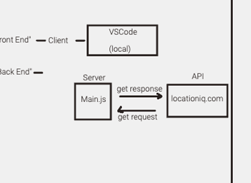
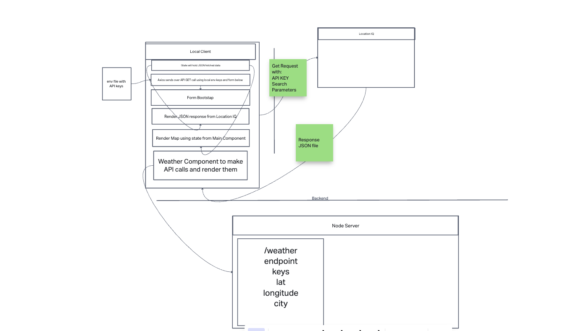
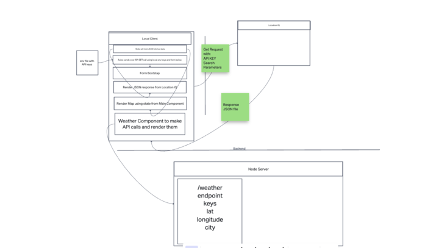

Name of feature: City Explorer

17 Apr 23 Lab 06
Estimate of time needed to complete: 3 hrs

Start time: 4:30 pm

Finish time: 11:17 pm

Actual time needed to complete: 7 hrs

18 Apr 23 Lab 07
Estimate of time needed to complete: 3 hrs

Start time: 5:00 pm

Finish time: 1:05 am

Actual time needed to complete: 8 hrs

Time Estimates

For each of the lab features, make an estimate of the time it will take you to complete the feature, and record your start and finish times for that feature:

Name of feature: Lab 10 Feature 1

Estimate of time needed to complete: 6 hours

Start time: 4:30 pm

Finish time: 12:00 am

Actual time needed to complete: 5 hours

**Author**: Coriana Williams
**Version**: 1.0.0 (increment the patch/fix version number if you make more commits past your first submission)

## Overview
<!-- Provide a high level overview of what this application is and why you are building it, beyond the fact that it's an assignment for this class. (i.e. What's your problem domain?) -->

## Getting Started
<!-- What are the steps that a user must take in order to build this app on their own machine and get it running? -->

## Architecture
<!-- Provide a detailed description of the application design. What technologies (languages, libraries, etc) you're using, and any other relevant design information. -->

## Change Log
<!-- Use this area to document the iterative changes made to your application as each feature is successfully implemented. Use time stamps. Here's an example:

01-01-2001 4:59pm - Application now has a fully-functional express server, with a GET route for the location resource. -->

## Credit and Collaborations
